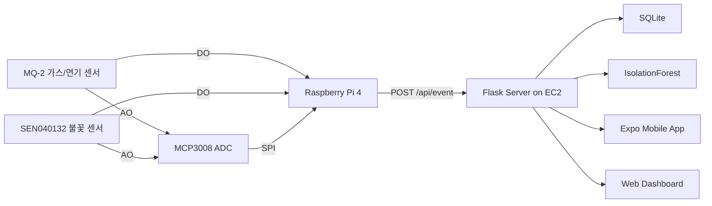

# 창고 화재·이상 징후 감지 시스템

라즈베리파이 기반 센서 데이터를 수집해 창고 내 가스/연기 및 불꽃 이상 징후를 감지하고, Flask 서버와 모바일 앱에서 실시간으로 모니터링하는 캡스톤 프로젝트입니다.

## 주요 기능

- MQ-2 가스/연기 센서와 SEN040132 불꽃 센서 데이터 수집
- MCP3008 ADC를 이용한 AO 아날로그 값 수집
- 라즈베리파이에서 Flask 서버로 2초 주기 센서 데이터 전송
- SQLite 기반 센서/경고 이력 저장
- IsolationForest 기반 AI 이상 징후 탐지
- Expo/React Native 모바일 앱 실시간 대시보드, 그래프, 경고 이력, AI 설정 화면

## 시스템 구조



## 저장소 구조

```text
.
├── assets/              # 시연 스크린샷과 하드웨어 사진
├── docs/                # 개발 일정, 진행 현황, 시스템 구성도, ERD
├── hardware/            # 부품/배선 설명
├── mobile/              # Expo React Native 앱
├── raspberrypi/         # 라즈베리파이 센서 수집 코드
├── releases/            # APK는 GitHub Releases에 첨부
├── scripts/             # 배포 예시 스크립트
└── server/              # Flask API 서버
```

## 실행 요약

서버:

```bash
cd server
python -m venv .venv
source .venv/bin/activate
pip install -r requirements.txt
export FIRE_DB_PATH=~/warehouse-server/sensor.db
python app.py
```

라즈베리파이:

```bash
cd raspberrypi
pip install -r requirements.txt
export FIRE_SERVER_URL=http://<SERVER_HOST>:5000/api/event
python sensor_test.py
```

모바일 앱:

```bash
cd mobile
npm install
cp .env.example .env
# .env의 EXPO_PUBLIC_SERVER_URL 수정
npm start
```

## 문서

- [개발 일정](docs/development-schedule.md)
- [시스템 구성도](docs/architecture.md)
- [ERD](docs/erd.md)
- [2026-05-07 진행 현황](docs/progress-2026-05-07.md)
- [2026-05-15 진행 현황](docs/progress-2026-05-15.md)

## 시연 화면


## 주의사항

- 서버 IP, SSH 키, `.env`, APK, 분할 압축 파일은 저장소에 커밋하지 않습니다.
- APK는 저장소에 직접 넣기보다 GitHub Releases에 첨부하는 것을 권장합니다.
- `/api/ai/reset`, `/api/ai/retrain` 같은 관리 API는 실제 운영 시 인증을 붙여야 합니다.
